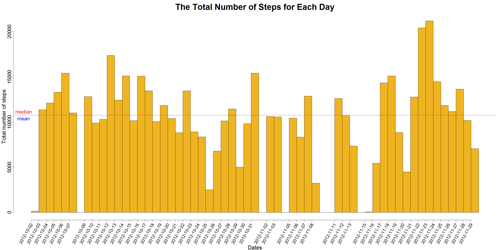
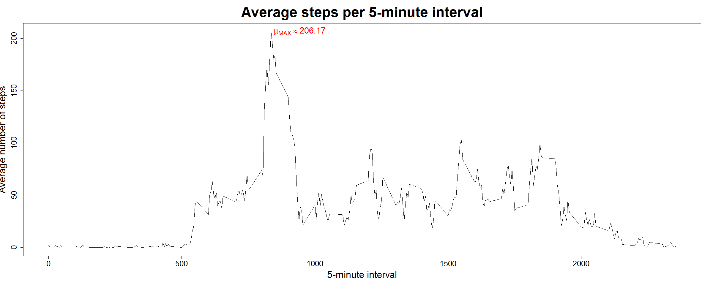
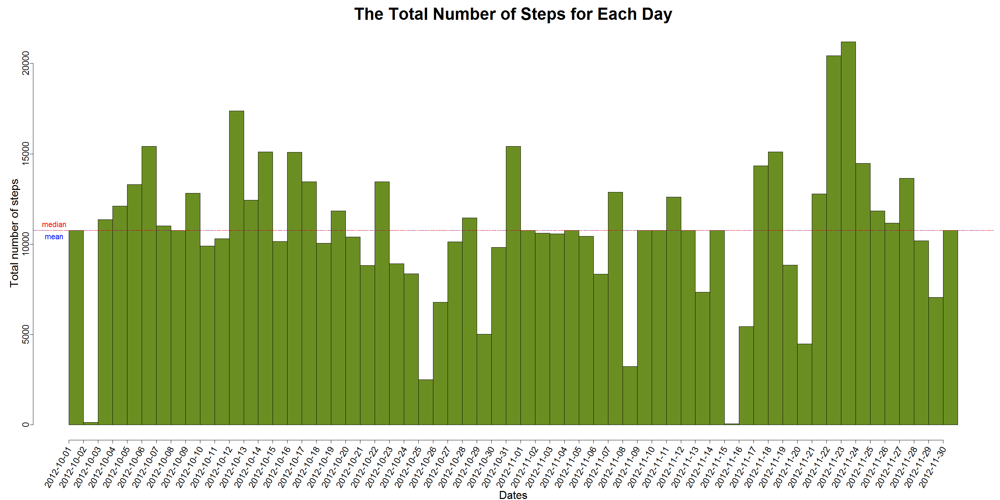
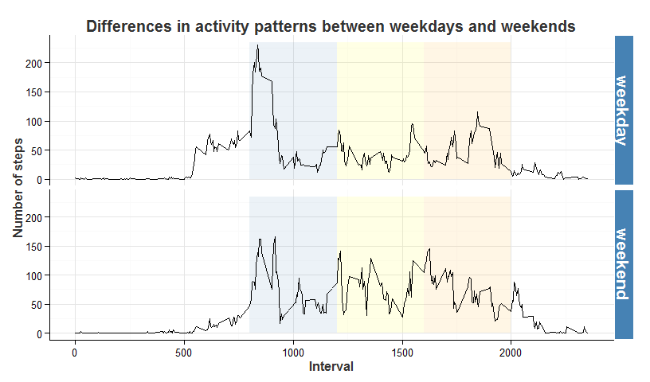

# Reproducible Research: Peer Assessment 1

----------

## Loading and preprocessing the data  

### Load requirement library  


```r
library(data.table, warn.conflicts = FALSE)
library(lubridate, warn.conflicts = FALSE)
library(ggplot2, warn.conflicts = FALSE)
```

### Load the downloaded data from zip file and arrange data for plotting 


```r
# Read the csv file inside the zip file without unzip
act_data <- fread(unzip("activity.zip", "activity.csv"))
# Remove NA values
adc <- act_data[complete.cases(steps)]
# Set one day start point
adc[, datetime := ymd_hms(paste(date, "00:00:01"))]
# Calculate the total number of steps taken per day
total_step <- adc[, .(total = sum(steps)), by = datetime]
# Expand the step for each day
reps <- rep(total_step$datetime, total_step$total)
```

## What is mean total number of steps taken per day?  

### A histogram of the total number of steps taken each day  


```r
par(mar = c(9, 4, 4, 1))
hist(reps, breaks = "days", freq = TRUE, las = 3,format = "%Y-%m-%d", cex.lab = 2.0, cex.axis = 1.8, xlab= "",
     ylab = "Total number of steps", main = "The Total Number of Steps for Each Day",
     mgp = c(2.1, 0.5, 0), cex.main = 3, col = "goldenrod2", xaxt = "n")
# Customize x label name
mtext(1, text = "Dates", line = 8, cex = 2.0, col = "Black")
date_label <- ymd(unique(adc$date))
# Customize x axis
axis(1, at = date_label, col = "black", labels = FALSE)
text(date_label, par("usr")[3]-380, srt = 60, adj = 1, labels = date_label, xpd = TRUE, cex = 1.6)
axis(2, col = "black", labels = FALSE)
# Horizontal line for mean of total step for all days 
#  and Annotation text for the horizontal line
abline(h = mean(total_step$total), lty = 2, col = "blue")
text(ymd_hms("2012-10-01 00:00:01"), mean(total_step$total), labels = "mean", col = "blue", pos = 1, cex = 1.8)
abline(h = median(total_step$total), lty = 4, col = "red")
text(ymd_hms("2012-10-01 00:00:01"), median(total_step$total), labels = "median", col ="red", pos = 3, cex = 1.8)
```

 

> #### The line for <font color = "blue">mean</font> and <font color = "red">median</font> of the total number of steps taken per day are very close on the histogram. There numbers will be show below:


```r
mean_total_steps <- print(as.character(round(as.double(mean(total_step$total)), 2)))
```

```
## [1] "10766.19"
```

```r
median_total_steps <- print(median(total_step$total))
```

```
## [1] 10765
```

> #### The mean of the total number of steps taken per day approximately is <font color = "red">10766.19</font>  
> #### The median of the total number of steps taken per day is <font color = "red">10765</font>

## What is the average daily activity pattern?  

### A time series plot of the 5-minute interval and the average number of steps taken


```r
inter <- adc[, .(avg_steps = mean(steps)), by = interval]
plot(inter$interval,inter$avg_steps,type = "l", xlab = "5-minute interval", ylab = "Average number of steps", 
     main = "Average steps per 5-minute interval", cex.lab = 2.0, cex.axis = 1.6, cex.main = 3)
abline(v = inter[which.max(inter$avg_steps), interval], lty = 4, col = "red")
max_avg_step <- as.character(round(as.double(max(inter$avg_steps)), 2))
text(inter[which.max(inter$avg_steps), interval], max(inter$avg_steps), col = "red", pos = 4, cex = 1.8,
     labels = bquote(paste(mu[MAX]%~~% .(max_avg_step))))
```

 

> #### The max average number of steps group by interval across all days approximately is <font color = "red">206.17</font> and it shows on the above plot with red vertical line and text.


```r
max_interval <- print(inter[which.max(inter$avg_steps), interval])
```

```
## [1] 835
```

> #### The 5-minute interval contains the maximum number of steps is <font color = "red">835</font>

## Imputing missing values  

### Missing values  


```r
missing_values <- print(sum(is.na(act_data$steps)))
```

```
## [1] 2304
```
> #### The total number of missing values in the dataset is <font color = "red">2304</font>

### Use the "mean for that 5-minute interval" strategy. The strategy steps:

#### 1. Round the mean of each interval per day to integer

```r
inter[,round_mean_steps := as.integer(round(avg_steps))]
```

#### 2. To set the common key for `act_data`(raw data) and `inter`(data group by interval and round the mean of steps to integer)

```r
setkey(act_data,interval)
setkey(inter,interval)
```

#### 3. Create a new dataset `adinter` by `act_data` left outer join `inter`

```r
adinter <- act_data[inter]
```

#### 4. Imput the `NA` steps with new value from step 1

```r
adinter[which(is.na(steps)), steps := round_mean_steps]
```

### Arrange data for plotting

```r
# Set one day start point
adinter[, datetime := ymd_hms(paste(date, "00:00:01"))]
# Calculate the total number of steps taken per day
total_step_adinter <- adinter[, .(total=sum(steps)), by = datetime]
# Expand the step for each day
reps_adinter <- rep(total_step_adinter$datetime, total_step_adinter$total)
```

### A histogram of the total number of steps taken each day with the missing data filled in

```r
par(mar = c(9, 5, 4, 1))
hist(reps_adinter, breaks = "days", freq=TRUE, las = 3, format = "%Y-%m-%d", mgp = c(2.1, 0.5, 0),
     xlab = "", main = "The Total Number of Steps for Each Day", ylab = "Total number of steps",
     xaxt = "n", cex.lab = 2.0, cex.axis = 1.6, cex.main = 3, col = "olivedrab")
# Customize x label name
mtext(1, text = "Dates", line = 8, cex = 2.0, col = "Black")
date_label2 <- ymd(unique(adinter$date))
# Customize x axis
axis(1, at = date_label2, col = "black", labels = FALSE)
text(date_label2, par("usr")[3]-380, srt = 60, adj = 1, labels = date_label2, xpd = TRUE, cex = 1.6)
axis(2, col = "black", labels = FALSE)
# Horizontal line for mean of total step for all days 
# and Annotation text for the horizontal line
abline(h = mean(total_step_adinter$total), lty = 2, col = "blue")
text(ymd_hms("2012-09-30 00:00:01"), mean(total_step_adinter$total), labels = "mean", col = "blue", pos = 1, cex = 1.4)
abline(h = median(total_step_adinter$total), lty = 4, col = "red")
text(ymd_hms("2012-09-30 00:00:01"), median(total_step_adinter$total), labels = "median", col = "red", pos = 3, cex = 1.4)
```

 

> #### The line for <font color = "blue">mean</font> and <font color = "red">median</font> of the total number of steps taken per day are very close on the histogram. There numbers will be show below:


```r
mean_total_imput_steps <- print(as.character(round(as.double(mean(total_step_adinter$total)), 2)))
```

```
## [1] "10765.64"
```

```r
median_total_imput_steps <- print(median(total_step_adinter$total))
```

```
## [1] 10762
```
> #### The mean of the total number of steps taken per day approximately is <font color = "red">10765.64</font>
> #### The median of the total number of steps taken per day is <font color = "red">10762</font>


> From the result of mean and median between missing data and imputing data, the differ is small and the deviation of mean is  <font color = "red">0.55</font> and the deviation of median is <font color = "red">3</font>. Imputing missing data can fill all the day but not impact too much for the estimates of the total daily number of steps. And both of the mean and median are very close, it means the dataset doesn't appear outlier.

## Are there differences in activity patterns between weekdays and weekends?  

### A new factor variable in the dataset with two levels – “weekday” and “weekend” indicating whether a given date is a weekday or weekend day

```r
adinter[, week := factor(ifelse(wday(datetime) %in% c(1, 7), "weekend", "weekday"))]
```
### Make A panel plot containing a time series plot of the 5-minute interval and the average number of steps taken(averaged across all weekday days or weekend days)

```r
adinter_mean <- adinter[, .(avg_steps = mean(steps)), by = .(interval, week)]
# Set a ggplot theme
myTheme <- theme_bw() +
    theme(plot.title = element_text(colour = "gray20", size = 15, face = "bold"),
          panel.border = element_blank(),axis.line = element_line(colour = "black"),
          strip.text = element_text(face = "bold", size = rel(1.3), color = "white"),
          strip.background = element_rect(fill = "steelblue", colour = "white", size = 1),
          axis.title = element_text(face = "bold", colour = "gray20", size = rel(1.0)),
          legend.position = "none")
# Make a panel ggplot
ggplot(adinter_mean, aes(x = interval, y = avg_steps)) + labs(x = "Interval", y = "Number of steps") +
    ggtitle("Differences in activity patterns between weekdays and weekends") + 
    annotate("rect", xmin = 800, xmax = 1200, ymin = 0, ymax = 235, alpha = .1, fill = "steelblue") + 
    annotate("rect", xmin = 1200, xmax =1600, ymin = 0, ymax = 235, alpha = .1, fill = "yellow") + 
    annotate("rect", xmin = 1600, xmax = 2000, ymin = 0, ymax = 235, alpha = .1, fill = "orange") + 
    geom_line() + facet_grid(week~.) + myTheme
```

 

> Above figure shows distributions of person-hours steps by 5-minute interval of day. The shade part of the area shows <font style="color: steelblue">morning</font> at 8:00 a.m. to 12:00 p.m., <font style="color: #CDCD00; background-color: white">afternoon</font> at 12:00 p.m. to 4:00 p.m., and <font color = "#EE9A00">evening</font> at 4:00 p.m. to 8:00 p.m. It can be seen the activities peak on weekday and weekend are close, but the weekend activities are more evenly distributed throughout the day. Generally, weekday activities peak in the morning and evening are higher than weekend activities.
